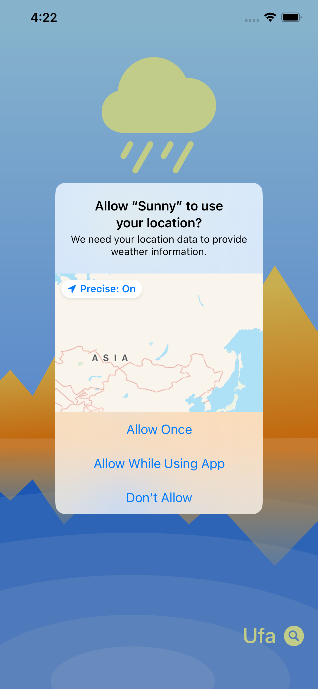
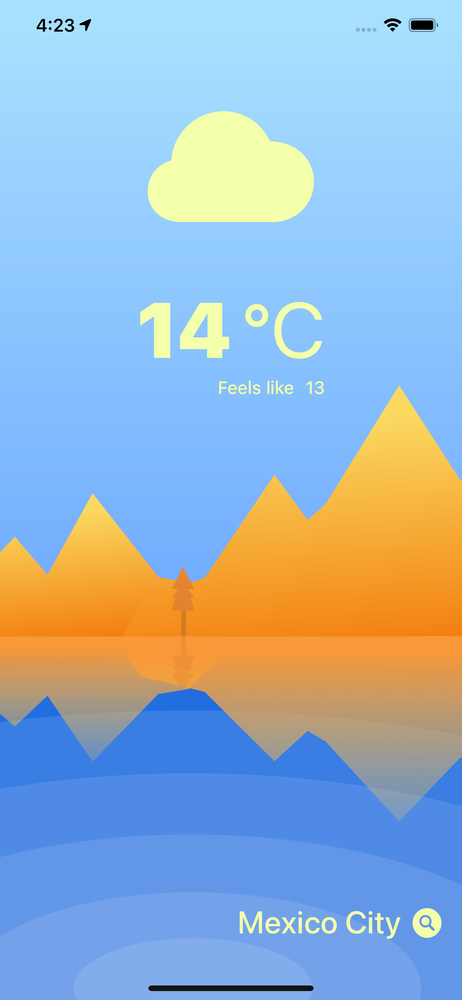
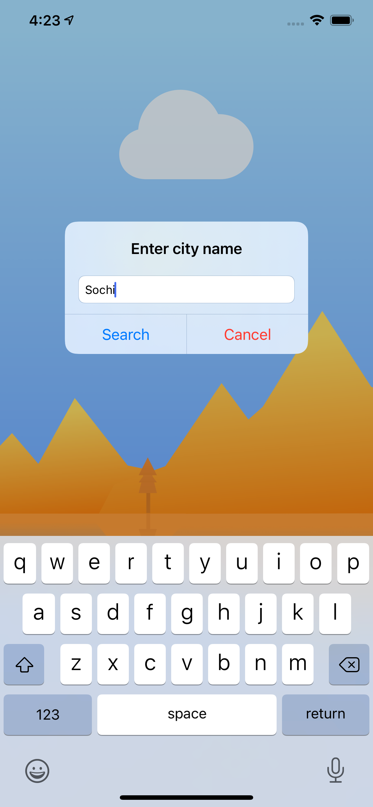
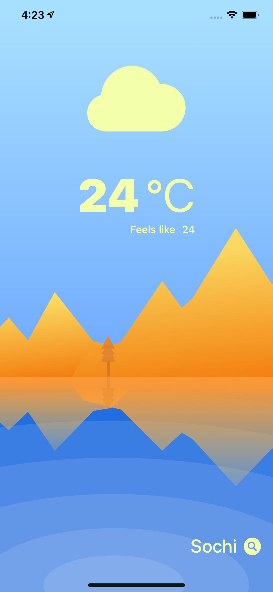

# Sunny
Мое первое погодное приложение с использованием API.

## Цель проекта 
- Использование различных способов реализации задач. 
- Знакомство с различными инструментами разработки.
- Отработка на практике полученных знаний. 

## Frameworks 
Для корректной работы используйте данные версии без обновления: 
  
- Core Location 
- Foundation
- UIKit
  

### Примеры экранов:

       

     
  
